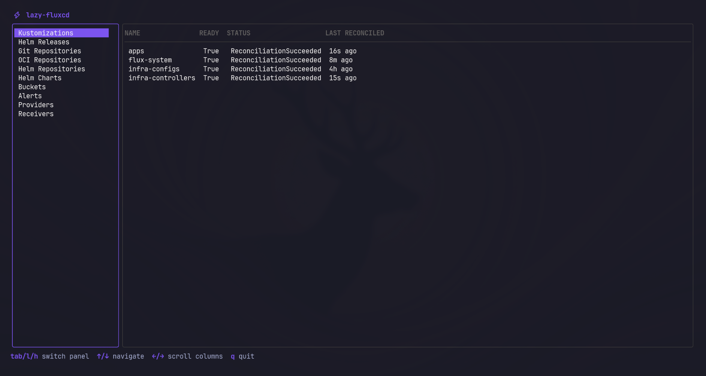

# lazy-fluxcd

A terminal UI for monitoring FluxCD resources in your cluster.


<p align="center">
  
</p>

## What it does

Gives you a live view of all your FluxCD resources — Kustomizations, Helm Releases, Sources, Notifications — without having to `kubectl get` each type one by one.

## Requirements

- Go 1.25+
- A Kubernetes cluster with FluxCD installed
- A valid `~/.kube/config` (or pass `--kubeconfig`)

## Installation

**Via `go install`:**
```bash
go install github.com/LotadTech/lazy-fluxcd@latest
lazy-fluxcd
```

**From source:**
```bash
git clone https://github.com/LotadTech/lazy-fluxcd
cd lazy-fluxcd
make build
./lazy-fluxcd
```

## Usage

```bash
# Uses ~/.kube/config by default
lazy-fluxcd

# Point at a specific kubeconfig
lazy-fluxcd --kubeconfig /path/to/config
```

## Make targets

| Target | Description |
|--------|-------------|
| `make build` | Compile the binary |
| `make run` | Run directly with `go run` |
| `make tidy` | Tidy Go modules |
| `make lint` | Run `go vet` |
| `make clean` | Remove the compiled binary |

## Keybindings

| Key | Action |
|-----|--------|
| `tab` / `l` | Focus resource panel |
| `h` | Focus sidebar |
| `j` / `↓` | Scroll down |
| `k` / `↑` | Scroll up |
| `←` | Scroll columns left |
| `→` | Scroll columns right |
| `q` / `ctrl+c` | Quit |

## Resource types

| Controller | Resources |
|---|---|
| Kustomize | Kustomizations |
| Helm | Helm Releases |
| Source | Git Repositories, OCI Repositories, Helm Repositories, Helm Charts, Buckets |
| Notification | Alerts, Providers, Receivers |

## Columns

Each resource shows **NAME**, **READY**, **STATUS**, and **LAST RECONCILED** (time since the last Ready condition transition).
